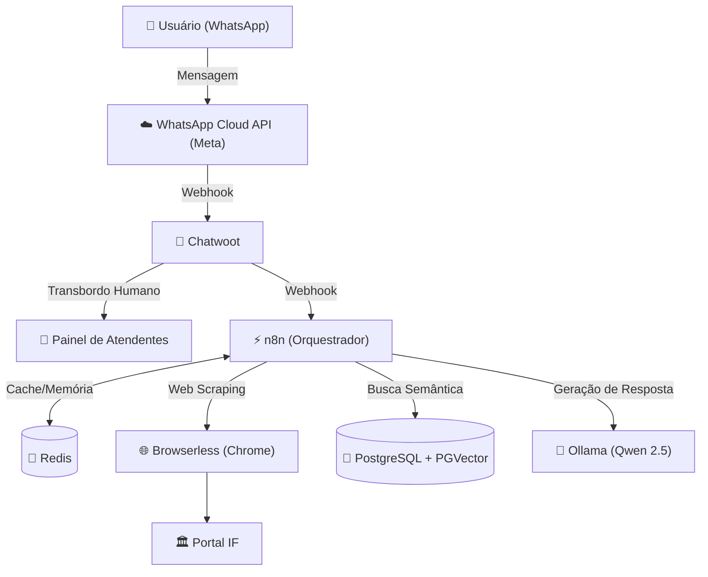

# 🤖 IF Agent - Assistente Virtual para Processos Seletivos

[](https://www.docker.com/)
[](https://n8n.io/)
[](https://www.chatwoot.com/)
[](https://www.postgresql.org/)
[](https://ollama.ai/)

O **IF Agent** é uma solução de extensão tecnológica voltada ao suporte e orientação automatizada para candidatos dos processos seletivos de graduação do **Instituto Federal do Sudeste de Minas Gerais — Campus Barbacena**. 

O sistema utiliza a arquitetura **RAG (*Retrieval-Augmented Generation*)** com modelos de linguagem locais (*LLM*) para responder a dúvidas com base estrita no Edital vigente e no Calendário Acadêmico, oferecendo transbordo para atendimento humano quando necessário.


## Funcionalidades Principais

- **Atendimento Automatizado via WhatsApp:** Integração nativa com a API Cloud do WhatsApp através da plataforma Chatwoot.
- **Respostas Precisas via RAG:** Consultas semânticas em tempo real ao edital e calendário oficial usando `pgvector` e o modelo local `Qwen-2.5-7B`.
- **Web Scraping Autônomo:** Raspagem periódica e higienização automática do portal oficial do IF usando `Browserless`.
- **Transbordo Humano (*Omnichannel*):** Triagem automática de conversas no Chatwoot, permitindo que atendentes assumam interações complexas em tempo real.
- **Soberania de Dados e Custo Zero:** Arquitetura 100% *open-source* rodando localmente via Docker, sem envio de dados institucionais para APIs pagas de terceiros.


## Arquitetura do Sistema

A infraestrutura é baseada em microsserviços isolados e orquestrados via **Docker Compose**:



## Tecnologias Utilizadas
| Serviço | Imagem Docker | Função no Ecossistema |
| :--- | :--- | :--- |
| **n8n** | `n8nio/n8n:latest` | Fluxo lógico, gerenciamento de sessões e orquestração do RAG. |
| **Browserless** | `browserless/chrome:latest` | Chromium *headless* para raspagem de dados web do portal do IF. |
| **Ollama** | `ollama/ollama:latest` | Hospedagem local do modelo LLM (`Qwen-2.5-7B`) e geração de *embeddings*. |
| **Chatwoot** | `chatwoot/chatwoot:latest` | Central de atendimento *omnichannel* e gerenciamento de contatos. |
| **Chatwoot Worker**| `chatwoot/chatwoot:latest` | Processamento de tarefas assíncronas em segundo plano via Sidekiq. |
| **Redis** | `redis:7` | Armazenamento temporário de filas e controle de estado do Chatwoot. |
| **PostgreSQL** | `pgvector/pgvector:pg15` | Banco relacional do Chatwoot e banco vetorial do RAG. |
| **pgAdmin** | `dpage/pgadmin4:latest` | Interface gráfica web para administração e auditoria do PostgreSQL. |


## Como Executar o Projeto

### Pré-requisitos
- [Docker](https://docs.docker.com/get-docker/) e [Docker Compose](https://docs.docker.com/compose/install/) instalados.
- [ngrok](https://ngrok.com/) para exposição de *endpoints* seguros em ambiente de desenvolvimento local.
- Conta no [Meta for Developers](https://developers.facebook.com/) configurada para o WhatsApp Cloud API.

1. Clonar o Repositório
```bash
git clone https://github.com/tainararcs/if-agent.git
cd if-agent
```

2. Subir os Containers Docker
```bash
docker compose up -d
```

3. Baixar o modelo Qwen 2.5 e o modelo de embeddings no container do Ollama
```bash
docker exec -it ollama ollama run qwen2.5
docker exec -it ollama ollama pull nomic-embed-text
```

4. Portas e Acessos aos Serviços
- Chatwoot: http://localhost:3000 
- n8n: http://localhost:5678
- pgAdmin: http://localhost:5050
- Ollama API: http://localhost:11434


## Configuração da Sandbox da Meta (WhatsApp)

Devido às políticas de Business Verification da Meta para contas corporativas, será necessário que a empresa termine essa estapa ou utilize o em ambiente de Sandbox:
A integração com o WhatsApp exige um aplicativo cadastrado no [Meta for Developers](https://developers.facebook.com/). Pod-se seguir por dois caminhos, dependendo do seu objetivo:

### Opção A: Ambiente de Testes (Sandbox/Modo Desenvolvedor)

1. Acesse o [Meta for Developers](https://developers.facebook.com/) e crie um aplicativo do tipo **Outro** / **Conectar-se com clientes pelo WhatsApp**.
2. Na aba **Configuração do WhatsApp**, utilize o **Número de Teste Gratuito** fornecido pela Meta.
3. **Adicionar Destinatários (Allowlist):** Como o número de teste é restrito, cadastre manualmente os números de telefone dos testadores.
4. **Configurar Webhook:**
   - Cole a URL de Webhook gerada no Chatwoot (utilizando a URL do `ngrok` ou do seu domínio seguro).
   - Insira o *Verify Token* configurado no Chatwoot (`Imbox Wpp Channel`).
   - Assine os eventos obrigatórios: `messages` e `message_template_status_update`.

### Opção B: Ambiente Oficial / Produção (Empresa / Instituição)

1. **Verificação de Empresa (Business Verification):** No Gerenciador de Negócios da Meta (*Meta Business Suite*), conclua a etapa de verificação.
2. **Adicionar Número Próprio:** Cadastre e valide o número de telefone oficial (comprado via SIM Card ou número fixo) recebendo o código de confirmação.
3. **Configuração de Webhook e Produção:**
   - Vincule a URL do Webhook do seu servidor de produção (`https://seu-dominio.com/webhooks/whatsapp`).
   - Assine os eventos de mensagens (`messages`).
